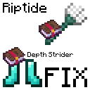

# Riptide Depth Strider Fix

This mod fixes the bug where riptiding through water with depth strider on generates immense drag, slowing you way down.

I originally created this mod for personal use, but decided to publish it because I thought others might find it useful as well.

Please be careful when using this mod on public servers. Riptiding quickly even though you are wearing depth strider could trigger anti-cheat plugins, although I haven't tested it.

# Disclaimer
A solution to this bug was suggested on [the bug report](https://bugs.mojang.com/browse/MC-136249) by the user __null. I used their code analysis while writing this mod, and ported it to work with Minecraft 1.21.4.
